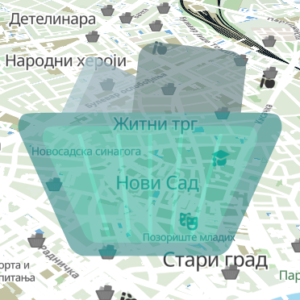

# Kabasti-NS

  

Application displaying the locations and dates for the collection and removal of bulky waste by the [Public Utility Company](https://www.cistocans.rs) in the territory of the city of Novi Sad.

***Features***:
+ Offline/Online installation and usage
+ Followings filter
+ Reminder notifications
+ Fullscreen toggle (F11/Esc)
+ Fourlingual support: Serbian (Cyrillic / Latin), Hungarian, Slovakian and English 

Note: This is an independent user utility and is not an official application of the local self-government or the public utility company.

  
🇷🇸 СРБ

Апликација приказа позиција и датума прикупљања и одвожења кабастог отпада од стране <a href="https://www.cistocans.rs">Јавног комунланог предузећа</a> на територији града Новог Сада.

***Функције***:
+ Офлајн/онлајн инсталација и коришћење
+ Филтер праћења
+ Подсетници у виду обавештења
+ Пребацивање преко целог екрана (F11/Esc)
+ Четворојезична подршка: Српски (Ћирилица / Латиница), Мађарски, Словачки и Енглески 

Напомена: Ово је независна корисничка алатка и није званична апликација локалне самоуправе или комуналног предузећа.

  
🇷🇸 SRB

Apilikacija prikaza pozicija i datuma prikupljanja i odvoženja kabastog otpada od strane <a href="https://www.cistocans.rs">Javnog komunalnog preduzeća</a> na teritoriji grada Novog Sada.

***Funkcije***:
+ Oflajn/onlajn instalacija i korišćenje
+ Filter praćenja
+ Podsetnici u vidu obaveštenja
+ Prebacivanje preko celog ekrana (F11/Esc)
+ Četvorojezična podrška: Srpski (Ćirilica / Latinica), Mađarski, Slovački i Engleski 

Napomena: Ovo je nezavisna korisnička alatka i nije zvanična aplikacija lokalne samouprave ili komunalnog preduzeća.

  
🇭🇺 HU

Alkalmazás, amely megjeleníti a lombtalanítási és a nagyméretű hulladékgyűjtési helyszíneket és időpontokat a <a href="https://www.cistocans.rs">Közműszolgáltató Vállalat</a> által Újvidék Város területén.

***Funkciók***:
+ Offline/online telepítés és használat
+ Nyomon követési szűrő
+ Értesítési emlékeztetők
+ Teljes képernyős váltás (F11/Esc)
+ Négynyelvű támogatás: Szerb (cirill / latin), Magyar, Szlovák és Angol 

Megjegyzés: Ez egy független felhasználói segédeszköz, és nem a helyi önkormányzat vagy a közműszolgáltató vállalat hivatalos alkalmazása.

  
🇸🇰 SK

Aplikácia zobrazujúca miesta a dátumy zberu a odvozu veľkoobjemového odpadu <a href="https://www.cistocans.rs">Verejným komunálnym podnikom</a> na území mesta Nový Sad.

***Funkcie***:
+ Offline/Online inštalácia a používanie
+ Filter sledovaných položiek
+ Pripomienkové notifikácie
+ Prepnutie na celú obrazovku (F11/Esc)
+ Štvorjazyčná podpora: srbčina (cyrilika / latinka), maďarčina, slovenčina a angličtina

Poznámka: Toto je nezávislý používateľský nástroj a nie je oficiálnou aplikáciou miestnej samosprávy ani verejného komunálneho podniku.

---

## ⚖️ Лиценца и Услови / Licenca i Uslovi / Licenc és Feltételek / Licencia a podmienky / License & Terms

### СРПСКИ (Ћирилица)
* **Лиценца апликације:** Власнички бесплатни софтвер ([Детаљни услови](TERMS_OF_SERVICE.md#српски-ћирилица))
* **Политика приватности:** Потпуно одсуство прикупљања података ([Политика приватности](PRIVACY_POLICY.md#српски-ћирилица))
* **Лиценца за географске податке:** Аутори OpenStreetMap-а ([ODbL v1.0](DATA_LICENSE.md#српски-ћирилица))
* **Векторске иконице**: Преузете и модификоване са сајта [SVG Repo](https://svgrepo.com) (Дистрибуиране под open-source/CC0 лиценцама)

Преузимањем, инсталацијом или коришћењем ове апликације аутоматски прихватате наше Услове коришћења и Политику приватности. Апликација ради потпуно офлајн и не прикупља личне податке нити прати кориснике.

  <a href="SUPPORT.md#српски-ћирилица">
    <kbd>✉️ Контакт | Подршка 🤝</kbd>
  </a>

---

### SRPSKI (Latinica)
* **Licenca aplikacije:** Vlasnički besplatni softver ([Detaljni uslovi](TERMS_OF_SERVICE.md#srpski-latinica))
* **Politika privatnosti:** Potpuno odsustvo prikupljanja podataka ([Politika privatnosti](PRIVACY_POLICY.md#srpski-latinica))
* **Licenca za geografske podatke:** Autori OpenStreetMap-a ([ODbL v1.0](DATA_LICENSE.md#srpski-latinica))
* **Vektorske ikonice**: Preuzete i modifikovane sa sajta [SVG Repo](https://svgrepo.com) (Distribuirane pod open-source/CC0 licencama)

Preuzimanjem, instalacijom ili korišćenjem ove aplikacije automatski prihvatate naše Uslove korišćenja i Politiku privatnosti. Aplikacija radi potpuno oflajn i ne prikuplja lične podatke niti prati korisnike.

  <a href="SUPPORT.md#srpski-latinica">
    <kbd>✉️ Kontakt | Podrška 🤝</kbd>
  </a>

---

### MAGYAR
* **Alkalmazás licenc:** Tulajdonosi ingyenes szoftver ([Részletes feltételek](TERMS_OF_SERVICE.md#magyar))
* **Adatvédelmi irányelvek:** Teljes körű adatgyűjtés-mentesség ([Adatvédelmi nyilatkozat](PRIVACY_POLICY.md#magyar))
* **Térképadatok licence:** OpenStreetMap közreműködők ([ODbL v1.0](DATA_LICENSE.md#magyar))
* **Vektoros ikonok**: Az [SVG Repo](https://svgrepo.com) oldaláról származnak és módosítva lettek (Nyílt forráskódú/CC0 licencek alatt terjesztve)

Az alkalmazás letöltésével, telepítésével vagy használatával Ön automatikusan elfogadja a Felhasználási feltételeket és az Adatvédelmi nyilatkozatot. Az alkalmazás teljesen offline működik, nem gyűjt személyes adatokat és nem követi a felhasználókat.

  <a href="SUPPORT.md#magyar">
    <kbd>✉️ Kapcsolat | Támogatás 🤝</kbd>
  </a>

---

### SLOVAK
* **Licencia aplikácie:** Proprietárny freeware ([Úplné podmienky](TERMS_OF_SERVICE.md#slovak))
* **Rámec ochrany osobných údajov:** Nulový zber dát([Zásady ochrany osobných údajov](PRIVACY_POLICY.md#slovak))
* **Licencia mapových dát:** Prispievatelia OpenStreetMap ([ODbL v1.0](DATA_LICENSE.md#slovak))
* **Vektorové ikony**: Prevzaté a upravené z [SVG Repo](https://svgrepo.com) (Distribuované pod open-source/CC0 licenciami)

Stiahnutím, inštaláciou alebo používaním tejto aplikácie automaticky súhlasíte s našimi Všeobecnými obchodnými podmienkami a Zásadami ochrany osobných údajov. Tento softvér funguje úplne offline, rešpektuje vaše súkromie a nezhromažďuje žiadne osobné údaje používateľov ani nesleduje analytiku.

  <a href="SUPPORT.md#slovak">
    <kbd>✉️ Kontakt | Podpora 🤝</kbd>
  </a>

---

### ENGLISH
* **Application License:** Proprietary Freeware ([Full Terms](TERMS_OF_SERVICE.md#english))
* **Privacy Framework:** Zero Data Collection ([Privacy Policy](PRIVACY_POLICY.md#english))
* **Map Data License:** OpenStreetMap Contributors ([ODbL v1.0](DATA_LICENSE.md#english))
* **Vector Icons**: Sourced and modified from [SVG Repo](https://svgrepo.com) (Distributed under open-source/CC0 licenses)

By downloading, installing, or using this application, you automatically agree to our Terms of Service and Privacy Policy. This software operates entirely offline, respects your privacy, and does not collect any personal user data or track analytics.

  <a href="SUPPORT.md#english">
    <kbd>✉️ Contact | Support 🤝</kbd>
  </a>

